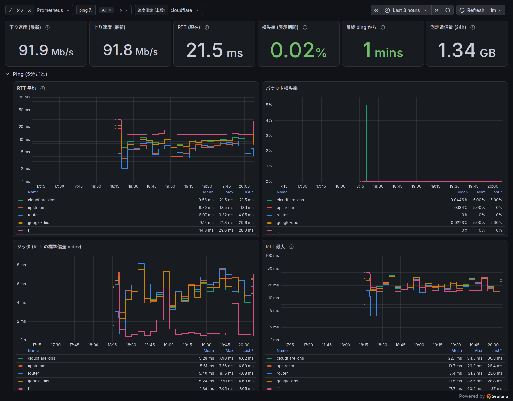
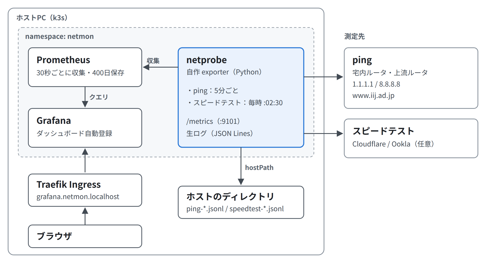

# k8s-netmon

[](https://github.com/sasakipochi/k8s-netmon/actions/workflows/ci.yml)
[](LICENSE)

自宅などのインターネット接続品質を Kubernetes 上で継続的に測定し、Prometheus に記録して Grafana で可視化する Helm チャートです。

> **English summary**: A self-contained Helm chart that monitors your internet connection quality.
> A small exporter (`netprobe`) pings multiple targets every 5 minutes and runs a speed test
> (Cloudflare, optionally Ookla) every hour; Prometheus stores the results and Grafana shows them
> on a pre-provisioned dashboard. Works on a single-node k3s at home or plugs into an existing
> kube-prometheus-stack.



## 特徴

- **ping (既定 5 分ごと)**: 複数の宛先へ 20 発ずつ送り、損失率・RTT (min/avg/max/mdev) を記録。
  宛先に `layer` (lan / upstream / internet) を付けて「宅内の問題か、回線の問題か」を切り分けられる
- **スピードテスト (既定 1 時間ごと)**: [Cloudflare](https://speed.cloudflare.com/) と、任意で [Speedtest by Ookla](https://www.speedtest.net/apps/cli) を順に実行。
  Ookla では転送中の遅延 (Bufferbloat) も記録
- **Prometheus + Grafana 同梱**: ダッシュボードとアラートルール入り。外部チャートへの依存なし
- **既存の監視基盤にも載せられる**: 同梱分を無効にし、ServiceMonitor と Grafana sidecar 用 ConfigMap だけを出力できる
- **生ログ**: 測定結果を JSON Lines でも保存 (PVC / hostPath)。ホストから直接 `jq` などで扱える
- 非 root・ケーパビリティなし・読み取り専用ルートファイルシステムで動作。amd64 / arm64 対応



## クイックスタート

```sh
helm upgrade --install netmon oci://ghcr.io/sasakipochi/charts/netmon \
  -n netmon --create-namespace -f values.yaml

kubectl -n netmon port-forward svc/netmon-grafana 3000:3000
# → http://localhost:3000/ (匿名で閲覧可能)
```

`values.yaml` には少なくとも ping の宛先を書きます。宅内ルータを入れておくと切り分けに役立ちます:

```yaml
probe:
  ping:
    targets:
      - { name: router,         host: 192.168.1.1,   layer: lan }
      - { name: cloudflare-dns, host: 1.1.1.1,       layer: internet }
      - { name: google-dns,     host: 8.8.8.8,       layer: internet }
      - { name: iij,            host: www.iij.ad.jp, layer: internet }
```

用途別の例:

- [`examples/values-k3s.yaml`](examples/values-k3s.yaml) — シングルノード k3s。Traefik Ingress (`http://grafana.netmon.localhost/`) と hostPath への生ログ出力
- [`examples/values-kube-prometheus-stack.yaml`](examples/values-kube-prometheus-stack.yaml) — 既存の Prometheus Operator / Grafana に載せる

全設定項目は [`chart/netmon/values.yaml`](chart/netmon/values.yaml) にコメント付きで載っています。

### Ookla Speedtest を使う場合

Speedtest by Ookla CLI はプロプライエタリソフトウェアで、**個人・非商用利用のみ**許諾されています。
そのためコンテナイメージには含めず、有効にした場合だけ Pod 起動時に initContainer が `install.speedtest.net` から取得します。
[EULA](https://www.speedtest.net/about/eula)・[利用規約](https://www.speedtest.net/about/terms)・[プライバシーポリシー](https://www.speedtest.net/about/privacy) を確認したうえで、次のように明示的に同意してください:

```yaml
probe:
  speedtest:
    ookla:
      enabled: true
      acceptLicense: true
```

測定結果 (グローバル IP アドレスを含む) は Ookla に送信・保存されます。Cloudflare のみで運用する場合は不要です。

## 測定データを見る

| 方法 | 内容 |
|---|---|
| Grafana | 「インターネット接続品質」ダッシュボード。管理者パスワードは `kubectl -n netmon get secret netmon-grafana -o jsonpath='{.data.admin-password}' \| base64 -d` |
| Prometheus | Graph / Alerts 画面、HTTP API |
| 生ログ | `ping-YYYY-MM.jsonl`, `speedtest-YYYY-MM.jsonl` (`probe.rawLog`) |
| exporter | `kubectl -n netmon port-forward svc/netmon-probe 9101` → `/metrics` |

```sh
# スピードテスト結果を CSV に
jq -r 'select(.success) | [.time, .backend, (.download_bps/1e6|floor), (.upload_bps/1e6|floor), .latency_idle_ms] | @csv' speedtest-*.jsonl

# 損失があった ping だけ
jq -c 'select(.loss > 0) | {time, target, loss, rtt_avg_ms}' ping-*.jsonl

# Prometheus API: 過去7日の 1.1.1.1 の平均 RTT (1時間ごと)
curl -sG http://<prometheus>/api/v1/query_range \
  --data-urlencode 'query=avg_over_time(netprobe_ping_rtt_seconds{target="cloudflare-dns",stat="avg"}[1h])' \
  --data-urlencode "start=$(date -d '7 days ago' +%s)" --data-urlencode "end=$(date +%s)" --data-urlencode step=3600
```

Prometheus / Grafana の PVC は `helm uninstall` しても残ります (`helm.sh/resource-policy: keep`)。

## 測定の設計について

### ping の宛先の選び方

「どこまでは正常で、どこから悪いか」を切り分けられるよう、**経路上の段階ごとに**置くのがおすすめです。
経路は `tracepath -n 1.1.1.1` などで確認できます。

| layer | 例 | 見えること |
|---|---|---|
| lan | 宅内ルータ | ここが悪ければ Wi‑Fi・宅内 LAN の問題 |
| upstream | ONU / ホームゲートウェイ (ルータが多段の場合) | 宅内機器の問題 |
| internet | 1.1.1.1 (Cloudflare) | Anycast で最寄り拠点に届き可用性が高い。「インターネットに出られるか」の基準 |
| internet | 8.8.8.8 (Google) | 別事業者。1.1.1.1 と同時に悪化すれば回線側、片方だけなら相手側 |
| internet | www.iij.ad.jp | 国内の別 ISP 網 (非 CDN)。国内 IX 経由の経路 |

- ISP 網内のルータは ICMP に応答しないことが多く、ISP 区間だけを測るのは難しい
- 1 つの宛先だけだと相手側の障害や ICMP の優先度低下と区別できないので、internet 層は複数の事業者に分ける
- 個人・小規模サイトやスピードテストサーバは宛先にしない
- 海外の宛先を 1 つ足すと国際回線の混雑も見える

### スピードテストの比較

| | Cloudflare (speed.cloudflare.com) | Ookla Speedtest CLI |
|---|---|---|
| 測定先 | Cloudflare の最寄り拠点 | 多数のサーバ (ISP・データセンター) から自動選択 |
| 得られる値 | 上下速度、待ち時間、ジッタ | 上下速度、待ち時間、ジッタ、損失、転送中の遅延 |
| ライセンス | 不要 | 個人・非商用のみ。明示的な同意が必要 |
| 注意点 | 1 Gbps 超の回線では Python 実装の性能が足りない可能性 | 自動選択だとサーバが変わり値がぶれる → `serverId` で固定推奨 |

2 つあると「測定サーバ側の問題か、回線の問題か」を区別できます。他の選択肢としては fast.com (Netflix) や iperf3 (自前サーバ) があります。

### 測定間隔と通信量

- 時間帯による変動 (夜間の混雑など) を見るには **1 時間ごとで十分**です
- スピードテストは回線を使い切るので通信量がかかります。約 100 Mbps の回線で **1 回あたり Cloudflare 約 250 MB + Ookla 約 100〜130 MB**
  (1 日約 8.5 GB、1 か月約 250 GB)。回線が速いほど比例して増えます。
  容量制限のある回線では `intervalSeconds` を延ばすか片方だけにしてください。ダッシュボードの「測定通信量 (24h)」で実量を確認できます
- 測定中 (30〜40 秒) は他の通信に影響し、逆に他の通信があると測定値が下がります
- 接続品質の主な指標は ping (損失・遅延・揺らぎ) です。ping は 5 分ごとに約 10 秒間なので、**5 分未満の瞬断は取りこぼします**。
  気になる場合は `probe.ping.intervalSeconds: 60` にしても負荷はほとんど増えません
- Wi‑Fi 接続の機器で測ると Wi‑Fi の品質 (省電力モードによる遅延など) も含まれます。回線そのものを測るなら有線接続の機器が理想です

## 主な設定

| キー | 既定値 | 内容 |
|---|---|---|
| `probe.image.repository` | `ghcr.io/sasakipochi/netprobe` | exporter のイメージ |
| `probe.ping.intervalSeconds` / `count` / `interval` | `300` / `20` / `0.5` | 測定間隔、1 回の発数、パケット間隔 (秒) |
| `probe.ping.targets` | 1.1.1.1, 8.8.8.8, www.iij.ad.jp | `name`, `host`, `layer` |
| `probe.speedtest.intervalSeconds` / `offsetSeconds` | `3600` / `150` | 毎時 :02:30 に開始 |
| `probe.speedtest.cloudflare.enabled` | `true` | |
| `probe.speedtest.ookla.enabled` / `acceptLicense` | `false` / `false` | 上記「Ookla Speedtest を使う場合」参照 |
| `probe.hostNetwork` | `false` | ホストのネットワークから直接測る |
| `probe.rawLog.type` | `pvc` | `pvc` / `hostPath` / `emptyDir` |
| `prometheus.enabled` / `retention` | `true` / `400d` | |
| `grafana.enabled` / `anonymous.enabled` | `true` / `true` | 匿名閲覧 (Viewer) を許可するか |
| `serviceMonitor.enabled` / `dashboardConfigMap.enabled` | `false` / `false` | 既存の監視基盤向け |
| `ingress.enabled` / `grafanaHost` / `prometheusHost` | `false` | |

> Grafana の匿名閲覧と Prometheus には認証がありません。Ingress で LAN やインターネットに公開する場合は注意してください。

## メトリクス

| メトリクス | ラベル | 内容 |
|---|---|---|
| `netprobe_ping_rtt_seconds` | target, host, layer, stat (min/avg/max/mdev) | 直近ラウンドの RTT 統計 |
| `netprobe_ping_loss_ratio` | target, host, layer | 直近ラウンドの損失率 (0〜1) |
| `netprobe_ping_up` | target, host, layer | 1 発でも応答があれば 1 |
| `netprobe_ping_packets_{sent,received}_total` | target, host, layer | 送受信パケット数の累計 |
| `netprobe_speedtest_{download,upload}_bits_per_second` | backend | 速度 |
| `netprobe_speedtest_latency_seconds` | backend, phase (idle/download/upload) | 待ち時間 (無負荷時・転送中) |
| `netprobe_speedtest_jitter_seconds` / `_packet_loss_ratio` | backend | ジッタ / 損失 (損失は Ookla のみ) |
| `netprobe_speedtest_bytes_total` | backend, direction | 測定で使った通信量の累計 |
| `netprobe_speedtest_success` / `_failures_total` | backend | 成否 |
| `netprobe_speedtest_info` | backend, server_id, server_name, server_location, isp | 直近の測定サーバ |

同梱の Prometheus には、到達不能・損失 5% 超・スピードテスト連続失敗などのアラートルールが入っています (通知先は未設定)。

## 開発

```
image/        netprobe (Python) と Dockerfile
chart/netmon/ Helm チャート (dashboards/netmon.json は生成物)
tools/        Grafana ダッシュボード・図の生成スクリプト
docs/         README の画像 (figures/ に構成図・表の元 HTML)
tests/        ユニットテスト
examples/     values の例
```

```sh
make test       # ユニットテスト + helm lint / template
make registry   # (初回のみ) 127.0.0.1:5000 にローカルレジストリを起動
make            # イメージをビルド → localhost:5000 に push → helm upgrade --install
```

- ローカルの k3s では、k3s (containerd) が `localhost` のレジストリに HTTP で接続できるので、sudo や `registries.yaml` の設定なしでイメージを渡せます
- `make` は `values-local.yaml` があればそれを、なければ `examples/values-k3s.yaml` を使います (`VALUES=...` で変更可)
- ダッシュボードを変えるときは `tools/gen_dashboard.py` を編集して `make dashboard`
- 構成図・表の画像は `docs/figures/*.html` を編集して `./tools/render_figures.sh` (Google Chrome / Chromium が必要)
- exporter を変えたら `chart/netmon/Chart.yaml` の `version` / `appVersion` を上げる (`imagePullPolicy: IfNotPresent` のため)
- `v<version>` タグを push すると GitHub Actions がイメージ (`ghcr.io/sasakipochi/netprobe`) とチャート (`oci://ghcr.io/sasakipochi/charts/netmon`) を公開します

## ライセンス

[MIT](LICENSE)。Speedtest by Ookla CLI は本リポジトリに含まれず、Ookla のライセンスに従います。
